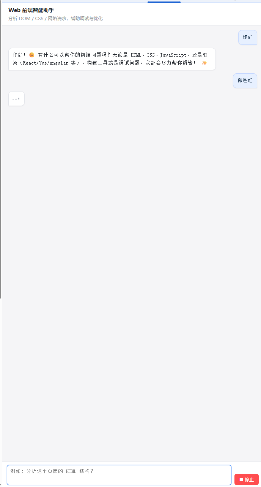
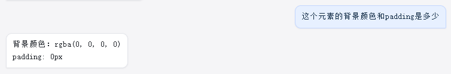
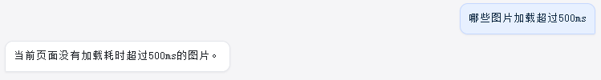
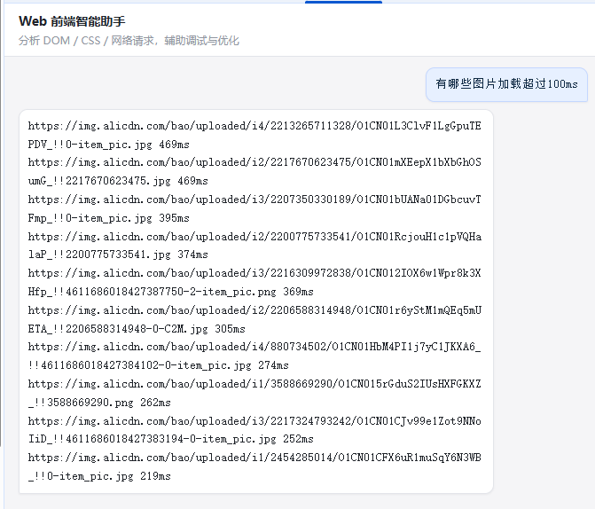
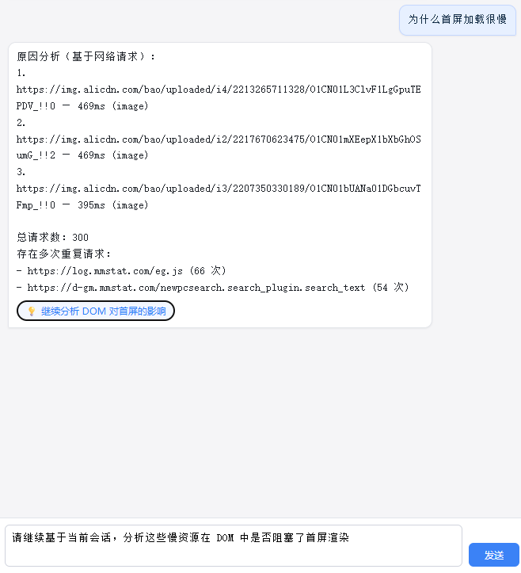
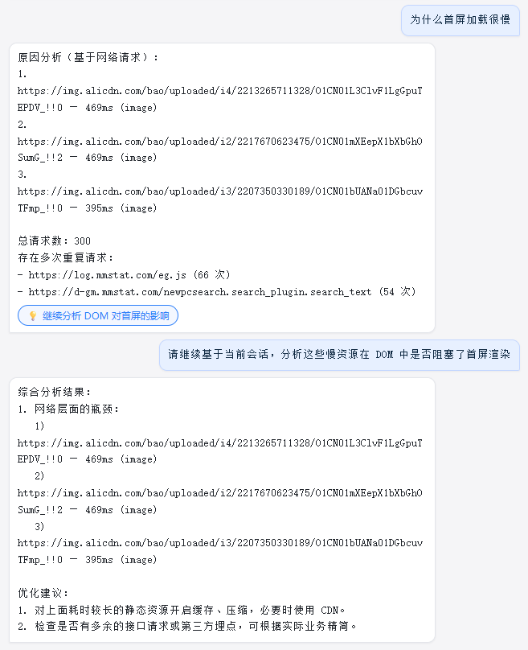
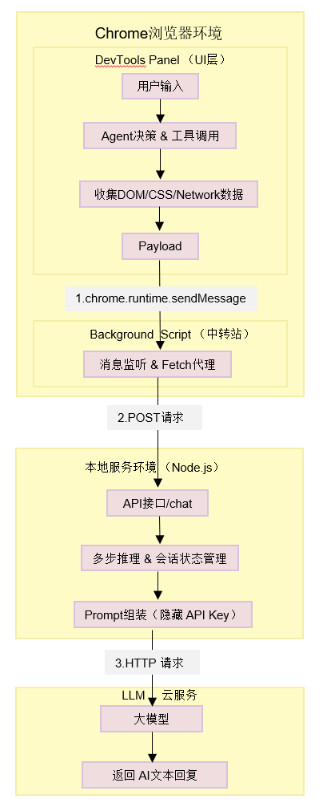

# AI DevTools Assistant（Web 前端智能助手）

一个运行在 Chrome DevTools 中的前端调试助手。  
它可以读取当前页面的 DOM / CSS / 网络请求信息，将这些数据发送到本地 Node.js 后端，再由后端调用大模型（LLM）进行分析和回答，辅助前端工程师完成页面结构分析、样式问题排查和性能优化。

---

## 1. 项目简介

- **项目类型**：Chrome DevTools 扩展 + Node.js 后端 + LLM
- **核心目标**：在浏览器内实现一个“前端智能调试终端”，通过自然语言对话快速完成：
  - 页面 DOM 与语义结构分析
  - 选中元素样式查询
  - 图片加载时间、首屏性能等网络问题诊断
  - 简单样式修改 / 代码执行

- **使用场景示例**
  - 「分析这个页面的 HTML 结构，有没有不合理的地方？」
  - 「当前选中元素的 color 和 padding 分别是多少？」
  - 「有哪些图片加载超过 500ms？」
  - 「为什么首屏加载很慢？给出原因和优化建议。」

---

## 2. 主要功能列表

### 2.1 DevTools Panel 聊天界面

- 在 Chrome DevTools 中新增一个自定义面板：`Web 前端智能助手`
- 提供类似聊天工具的对话界面：
  - 左侧为 AI 回复，右侧为用户提问
  - 支持滚动、loading 动画、错误提示
  - 支持一键点击“后续操作按钮”

  

### 2.2 DOM / CSS 分析能力

- 使用 `chrome.devtools.inspectedWindow.eval` 获取：
  - 当前选中元素 `$0` 的基础信息（tagName、textContent、outerHTML）
  - 选中元素的计算样式（color、font-size、padding、margin 等）
- 支持自然语言查询：
  - 「这个元素的 color 是什么？」
  - 「选中的这个按钮 padding 多大？」

   

### 2.3 网络请求与性能分析

- 使用 `chrome.devtools.network` 采集当前页面的 `SimpleRequest[]`：
  - `url` / `status` / `time` / `type`
- 支持场景：
  - 查询图片加载时间：  
    「哪些图片加载超过 500ms？」
  - 诊断首屏加载慢：  
    「为什么首屏加载很慢？」
    
  
  

### 2.4 多步推理智能体

- 为“首屏加载很慢”这种复杂问题设计了**两步推理流程**：
  1. **Step 1：网络分析**  
     - 基于 Network 数据找出耗时最长的请求，统计总请求数与重复请求
     - 返回“原因分析（基于网络请求）” + 一个「继续分析 DOM 对首屏的影响」按钮
  2. **Step 2：DOM + Network 综合分析**  
     - 结合上一步的慢请求和 DOM 结构，检查是否存在：
       - 同步 script（未使用 async/defer）
       - 疑似首屏大图（banner/hero/slider 等 img）
     - 输出“综合分析结果 + 优化建议”，在检测到首屏大图时，额外提供「生成图片 srcset 建议」按钮

    
    

- 使用 `sessionStates: Map<sessionId, AgentState>` 管理会话状态，实现简单的多步推理循环（Loop）。

### 2.5 可交互反馈与代码执行

- LLM 可以输出带有特殊标记的内容：
  - `<<<ACTION{...}>>>`：表示一个“下一步操作”按钮
  - `<<<CODE ... CODE>>>`：表示一段需要在页面上执行的 JavaScript 代码
- Panel 解析：
  - 自动渲染为按钮，点击后将内置问题填入输入框
  - 将 `CODE` 片段通过 `chrome.devtools.inspectedWindow.eval` 在当前页面执行
- 示例：
  - 「隐藏所有图片」→ 注入 `<style>img { display: none !important }</style>`
  - 「恢复」→ 删除之前注入的 `<style>` 节点
  
  
  

---

## 3. 技术架构图与说明

### 3.1 总体架构

1. **Chrome DevTools 扩展（前端部分）**
   - DevTools Panel（`src/panel/App.tsx`）：UI + Agent 调度 + 与 background 通信
   - Content Script（`src/content/index.ts`）：注入页面，采集标题、URL 等基础信息
   - Background Service Worker（`src/background/index.ts`）：作为 Panel 与 Node.js 后端的中转站

2. **Node.js 后端（`server/app.js`）**
   - 使用 Express 启动 HTTP 服务 `/chat`
   - 处理来自扩展的 JSON 请求（包含 userQuestion、context、toolsData）
   - 实现“多步推理”和会话状态管理（sessionStates）
   - 调用 LLM API（DeepSeek / 其他）并返回结果

3. **LLM 服务**
   - 通过 OpenAI SDK 兼容接口调用实际的大模型：
     - `baseURL = process.env.LLM_BASE_URL`
     - `apiKey = process.env.LLM_API_KEY`




### 3.2 通信流程说明

**基本链路：**

1. 用户在 DevTools Panel 输入问题，点击“发送”
2. Panel 调用：
   - `getPageInfo()` → 由 content script 获取当前页面信息
   - `getSelectedElementDetail()` → 通过 `chrome.devtools.inspectedWindow.eval` 读取 `$0` 元素
   - `runAgent(question)` → 决定要不要调用 DOM / CSS / Network 工具
3. Panel 将 `userQuestion + context + toolsData` 序列化为 JSON 字符串 `payload`
4. Panel 调用 `chrome.runtime.sendMessage({ type: 'AI_CHAT', payload })`
5. Background (`background/index.ts`) 监听消息并转发到 Node.js 后端：
   - `POST http://localhost:3000/chat { message: payload }`
6. Node.js 后端解析 JSON：
   - 判断是否为“首屏加载慢”多步流程
   - 或使用通用 system prompt 调用 LLM
7. LLM 返回回答文本，后端封装为 `{ reply }` 返回
8. Background 将 `{ reply }` 回传给 Panel
9. Panel 解析 `<<<ACTION>>>` 与 `<<<CODE>>>`，更新聊天记录并可选执行代码

---

## 4. 核心模块设计与实现描述

### 4.1 DevTools Panel（`src/panel/App.tsx`）

- 负责：
  - 聊天 UI 渲染
  - 管理消息历史 `history`
  - 收集页面上下文（pageInfo、selectedElement）
  - 调用 `runAgent` 决策工具
  - 通过 `chrome.runtime.sendMessage` 与 background 通信
  - 解析 LLM 返回的 `ACTION` / `CODE`

- 关键方法：
  - `handleSend()`：发送消息的主流程
  - `getPageInfo()`：通过 `tabs.sendMessage` 调 content script
  - `getSelectedElementDetail()`：通过 `inspectedWindow.eval` 获取 `$0` 详情

### 4.2 Agent 与工具（`src/agent/agent.ts` / `src/agent/tools/*.ts`）

- `runAgent(question: string)`：
  - 基于关键词简单路由，决定是否调用：
    - `getNetwork()`：获取网络请求列表
    - `getDOM()`：获取当前页面/片段 HTML
    - `getGlobalCSS()`：获取全局样式
  - 返回：
    - `usedTools: string[]`
    - `networkData` / `domHtml` / `cssStyles`

- 工具实现：
  - `getNetwork` 使用 `chrome.devtools.network.getHAR()` 或监听 `onRequestFinished`
  - `getDOM` 使用 `inspectedWindow.eval` 在页面中执行脚本
  - `getGlobalCSS` 读取 `<link rel="stylesheet">` 和 `<style>` 内容（选做）

### 4.3 Background（`src/background/index.ts`）

- 监听：
  - `chrome.runtime.onMessage.addListener`
- 对 `type === 'AI_CHAT'` 的消息：
  - 调用 `fetch('http://localhost:3000/chat')`
  - 将 LLM 回复 `{ reply }` 传回 Panel
- 好处：
  - 将后端访问集中在 background，Panel 更纯粹，架构更清晰

### 4.4 Node.js 后端（`server/app.js`）

- 主要职责：
  - 处理 `/chat` 请求，进行 JSON 解析和错误处理
  - 对“闲聊/打招呼”走轻量 prompt 直接返回
  - 对复杂问题走 Milestone 5 Prompt 和多步推理逻辑
- 多步推理：
  - 使用 `sessionStates: Map<sessionId, AgentState>`
  - 对“首屏加载慢”：
    - Step1：`firstScreenStep1(network)` → 原因分析（网络）+ ACTION
    - Step2：`firstScreenStep2(state, fullDom)` → 综合分析 + 优化建议 + 可选 ACTION
- LLM 调用：
  - 使用 `OpenAI` SDK，兼容 DeepSeek V3 等模型
  - `model: 'deepseek-ai/DeepSeek-V3'`

---

## 5. 开发与调试指南

### 5.1 环境准备

- Node.js 18+
- Chrome 浏览器（最新版）
- 一个可用的大模型 API（如 DeepSeek / OpenAI 协议兼容）

### 5.2 配置环境变量

在 `server` 目录下创建 `.env` 文件：

```bash
LLM_BASE_URL=https://api.xxx.com/v1
LLM_API_KEY=your_api_key_here
PORT=3000
```

### 5.3 启动 Node.js 后端

```bash
cd server
npm install
node app.js  
```

### 5.4 启动并构建 DevTools 扩展

```bash
cd extension
npm install
npm run build     
```

在 Chrome 中加载扩展：

1. 访问 `chrome://extensions/`
2. 打开「开发者模式」
3. 点击「加载已解压的扩展程序」，选择 `extension/dist` 目录

### 5.5 打开 DevTools Panel 测试

1. 打开任意网页
2. 按 `F12` 打开 Chrome DevTools
3. 在顶部 Tab 中找到 `Web 前端智能助手`
4. 在输入框中尝试：
   - 「你好」  
   - 「分析这个页面的 HTML 结构」  
   - 「当前选中元素的 color 是多少？」  
   - 「哪些图片加载超过 500ms？」  
   - 「为什么首屏加载很慢？」

---
